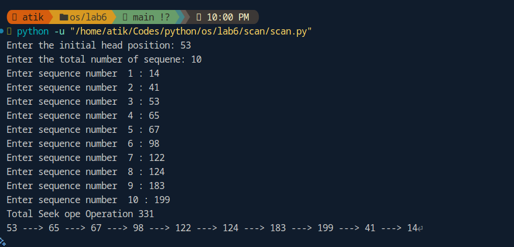
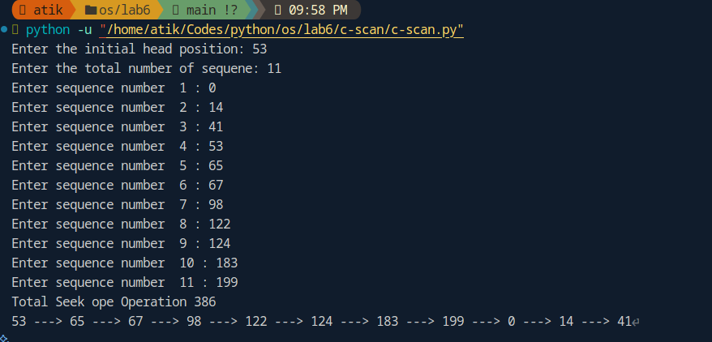

# Operating Systems Laboratory Work

This repository contains implementations of various Operating System concepts, primarily focusing on CPU Scheduling and Disk Scheduling algorithms. Each lab is implemented in Python and includes documentation and visual outputs.

## Course Structure

### CPU Scheduling Algorithms

1. **Lab 1: First Come First Serve (FCFS)**

   - Basic CPU scheduling algorithm
   - Non-preemptive scheduling
   - Implementation in `lab1/fcfs.py`

   

2. **Lab 2: Shortest Job First (SJF)**

   - CPU scheduling based on burst time
   - Non-preemptive scheduling
   - Implementation in `lab2/sjf.py`

   

3. **Lab 3: Round Robin**

   - Time quantum based scheduling
   - Preemptive scheduling
   - Implementation in `lab3/round-robin.py`

   

4. **Lab 4: Priority Scheduling**
   - Priority-based preemptive scheduling
   - Located in `lab4/priority-preemptive/`

### Disk Scheduling Algorithms

1. **Lab 4 & 5: SSTF (Shortest Seek Time First)**

   - Disk scheduling based on minimum seek time
   - Implementation in `lab5/sstf.py`

   

2. **Lab 6: SCAN and C-SCAN**

   - SCAN (Elevator) algorithm
   - Circular SCAN algorithm
   - Located in `lab6/scan/` and `lab6/c-scan/`

   

   

### Additional Resources

- **Mid Preparation**
  - Practice implementations
  - Additional examples
  - Located in `mid_prep/`

## Documentation

Each lab contains:

- Python implementation file
- PDF documentation with analysis
- Screenshots of execution results
- Visual representation of the code

## Requirements

- Python 3.x
- Basic understanding of Operating System concepts
- Knowledge of CPU and Disk scheduling algorithms

## How to Run

Each Python file can be executed independently. Navigate to the specific lab directory and run:

```bash
python filename.py
```

## Author

Md. Atikul Islam Atik
